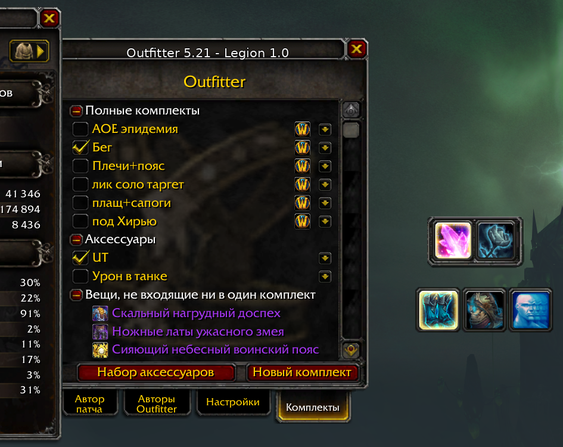
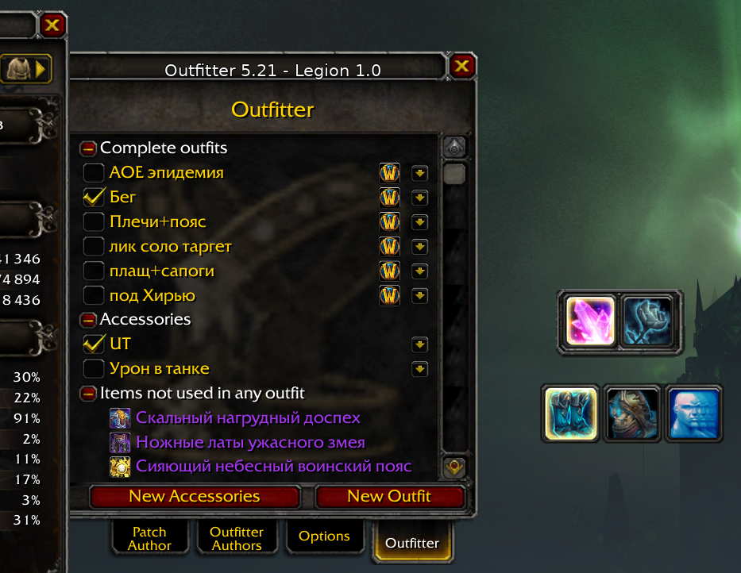

# Outfitter 5.21 — Legion 7.3.5

Совместимая ветка **Outfitter 5.21** для **World of Warcraft Legion 7.3.5 / Interface 70300**.

Оригинальный Outfitter разработан **John Stephen / Mundocani**. Эта ветка не присваивает авторство оригинального проекта: она основана на официальном Outfitter 5.21 и содержит только документированные исправления совместимости и дополнительные функции для Legion 7.3.5.

**Автор compatibility-патча:** JustAlex888  
**Оригинальный автор:** John Stephen / Mundocani  
**Upstream:** https://github.com/Mundocani/Outfitter — tag `5.21`  
**Лицензия оригинала:** MIT

## Что изменено

### Legion 7.3.5

- совместимость с `Interface 70300`;
- fallbacks для Legion API карты/зон и календаря;
- корректная обработка shapeshift API Legion;
- исправление подтверждённого падения меню, когда `GetTitleName()` возвращает `nil`;
- сохранены полезные исправления Equipment Manager и custom events из официального 5.21.

### Фильтрация комплект-панели по специализациям

Для комплекта можно выбрать одну или несколько специализаций.

Фильтр влияет **только на видимость иконки на комплект-панели** и сам по себе ничего не надевает.

Если специализации для старого комплекта не заданы, он считается доступным для всех специализаций.

### Наборы аксессуаров

Добавлен отдельный тип набора для двух тринкетов:

- используются только `Trinket0Slot` и `Trinket1Slot`;
- одновременно активен один набор аксессуаров;
- повторное нажатие на активный набор отключает его и возвращает тринкеты базового полного комплекта;
- набор аксессуаров не требует создавать отдельную копию каждого полного комплекта.

### Отдельная панель аксессуаров

Панель аксессуаров полностью независима от основной комплект-панели:

- отдельное положение;
- отдельный размер;
- прозрачность;
- прозрачность в бою;
- горизонтальное/вертикальное расположение;
- блокировка позиции;
- фон;
- отдельное show/hide.

Правый клик по серому drag-handle открывает настройки панели. Повторный правый клик, `Esc` или клик вне окна закрывает настройки.

### Интерфейс и локализация

- расширена и исправлена ruRU-локализация;
- `Всякая всячина` переименована в `Вещи, не входящие ни в один комплект`;
- старые partial-наборы сохранены в данных, но скрыты из основного пользовательского списка;
- добавлена отдельная страница `Автор патча`;
- оригинальная анимированная страница авторов Outfitter сохранена;
- исправлены смешанные RU/EN пункты контекстных меню.

Для проверки локализации можно принудительно переключить только интерфейс Outfitter:

```text
/outfitter lang en
/outfitter lang ru
/outfitter lang auto
```

Команда делает `/reload` и не меняет язык самого WoW-клиента.

## Установка

1. Закройте WoW.
2. Распакуйте release ZIP в `World of Warcraft/Interface/AddOns/`.
3. В результате должен существовать файл:
   `Interface/AddOns/Outfitter/Outfitter.toc`.
4. WTF/SavedVariables удалять не требуется.

Подробнее: [INSTALL.md](INSTALL.md).

## Совместимость данных

Сохранены без переименования:

- `gOutfitter_Settings`;
- `gOutfitter_GlobalSettings`;
- папка аддона `Outfitter`;
- существующие slash-команды;
- обычная архитектура настроек Outfitter.

## Скриншоты

### Русский интерфейс



### English interface



> Примечание: имена пользовательских комплектов, предметов и другие игровые данные берутся из клиента WoW и могут оставаться на языке клиента даже при принудительном переключении интерфейса Outfitter.

## Авторство и лицензии

Outfitter и его исходный код принадлежат оригинальным авторам. Compatibility-патч не заявляет авторство оригинального проекта.

- [ATTRIBUTION.md](ATTRIBUTION.md)
- [THIRD_PARTY_NOTICES.md](THIRD_PARTY_NOTICES.md)
- [LICENSE](LICENSE)

Оригинальный MIT-файл Outfitter также сохранён без изменений в `Outfitter/LICENSE`.

## Ограничения

Проект ориентирован на **Legion 7.3.5 / Interface 70300**. Поддержка современных Retail/Classic/BfA-клиентов не заявляется.

Подробнее: [KNOWN_LIMITATIONS.md](KNOWN_LIMITATIONS.md).
